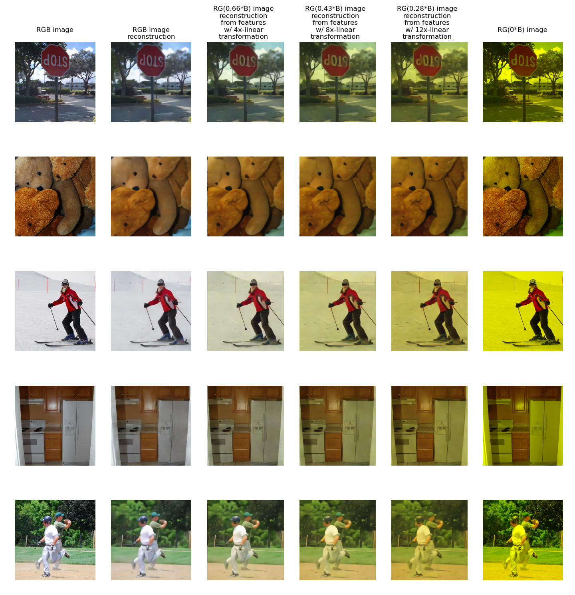
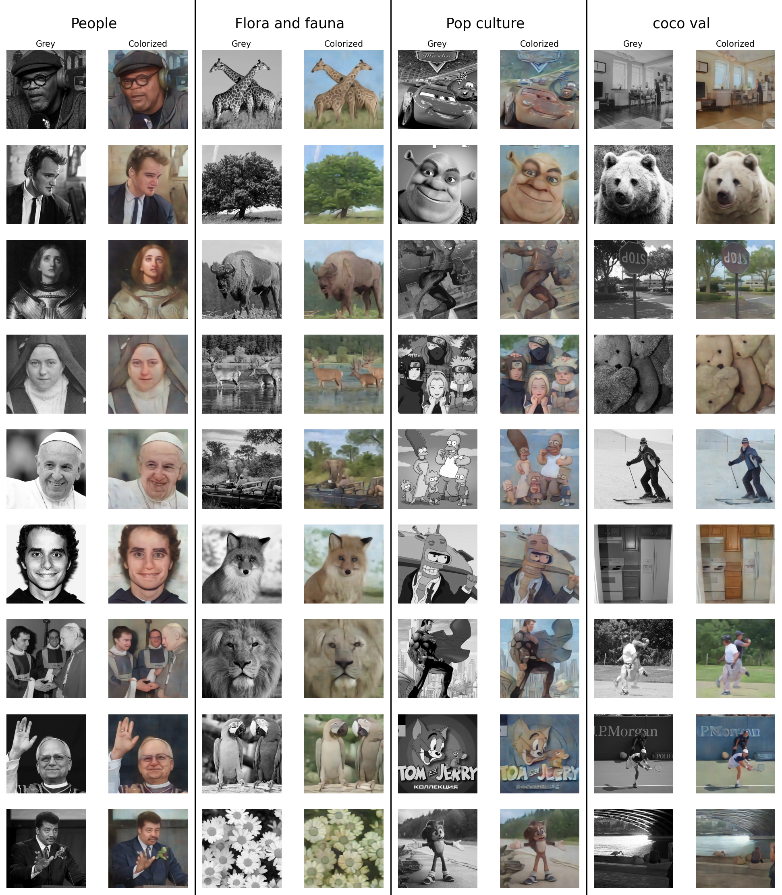

## Installation
To set up the environment, navigate to the root directory containing `environment.yml` and run:

```bash
conda env create --name interpretation_env --file environment.yml
conda activate interpretation_env
```

## Dataset Generation
Given a feature extractor *E* and an image *i*, we can obtain its features as *f = E(i)*. The reconstruction model is trained on pairs *(i, f)*. To generate such dataset pairs:

**Generate Validation Split**


```bash
# Prepare Data
mkdir coco_subsets

cd coco_subsets
wget http://images.cocodataset.org/zips/val2017.zip
wget http://images.cocodataset.org/zips/train2017.zip

unzip train2017.zip  # Extract archieve
unzip val2017.zip    # Extract archieve
cd -                 # Get back to project root
```

**Generate Validation Split Features**

Generated dataset size  ~ `300Mb`

```bash
# Run Validation Dataset Generation
VISION_MODEL="google/siglip2-base-patch16-512"
python dataset_generation/generation.py \
        --vision_model_name "$VISION_MODEL" \
        --coco_images_path "./coco_subsets/val2017" \
        --split val \
        --max_count 1000
```

**Generate Train Split Features**

Generated dataset size  ~ `30GB`

You may limit count of processed images with `--max_count 1000` parameter.

```bash
VISION_MODEL="google/siglip2-base-patch16-512"

python dataset_generation/generation.py \
        --vision_model_name "$VISION_MODEL" \
        --coco_images_path "./coco_subsets/train2017" \
        --split train
```

This script will:
1. Create `feature_extractor_weights` directory for storing pretrained weights
2. Generate datasets in `generated_datasets` directory
3. Use images from `coco_subsets/val2017` by default (configurable via script flags)

## Reconstruction Model Training
Run reconstructor training

Script running takes could take from 6 to 24 hours depending from model supported image resolution.
```bash
python training/train.py --vision_model_name $VISION_MODEL
```

This will:
- Train a reconstructor for `google/siglip2-base-patch16-512` by default
- Use the generated dataset from previous step
- Create `training/samples` for training logs
- Save weights in `training/checkpoint`

### Supported Feature Extractors:
- `google/siglip-base-patch16-{224,256,384,512}`
- `google/siglip2-base-patch16-{224,256,384,512}`

Modify the script arguments to use different extractors.

## CLIP Similarity Calculation
To compute CLIP similarity metrics:

1. Generate dataset for your target feature extractor
2. Train reconstructor or use precomputed [weights](https://drive.google.com/file/d/1i-B-5yBpSwcZL3_Z2Dz53jfxiY9T-fkb/view?usp=drive_link)
3. Place weights in `metrics_calculation/precalculated_weights/` following the pattern:
   - `models--google--siglip-base-patch16-512.pt`
   - `models--google--siglip2-base-patch16-512.pt`
4. Run:
   ```bash
   bash metrics_calculation/siglip_vs_siglip2/calculate_similarity.sh
   ```

For SigLIP vs SigLIP2 comparison:
1. Compute metrics for all 8 models
2. Run the analysis notebook:
   ```bash
   metrics_calculation/siglip_vs_siglip2/understanding_graphs_for_article.ipynb
   ```

Example output:
<div align="center">
<figure>
  
  <div>
    <figcaption>SigLIP vs SigLIP2 Feature Space Comparison</figcaption>
  </div>
</figure>
</div>

## Orthogonal Transformation Learning For R and B channels Swap
To study orthogonal transformations in feature space:

1. Generate dataset for `google/siglip2-base-patch16-512`
2. Train reconstructor or use precomputed [weights](https://drive.google.com/file/d/1i-B-5yBpSwcZL3_Z2Dz53jfxiY9T-fkb/view?usp=drive_link)
3. Place weights at:
   ```bash
   metrics_calculation/precalculated_weights/models--google--siglip2-base-patch16-512.pt
   ```
4. Run the analysis notebook:
   ```
   metrics_calculation/rb_swap/understanding_rgb-to-bgr_rotation.ipynb
   ```

Example output:
<div align="center">
<figure>
  
  <div>
    <figcaption>RGB Channel Swap in Feature Space</figcaption>
  </div>
</figure>
</div>


## Linear Transformation Learning For B Channel Suppression
To study linear transformations in feature space:

1. Generate dataset for `google/siglip2-base-patch16-512`
2. Train reconstructor or use precomputed [weights](https://drive.google.com/file/d/1i-B-5yBpSwcZL3_Z2Dz53jfxiY9T-fkb/view?usp=drive_link)
3. Place weights at:
   ```bash
   metrics_calculation/precalculated_weights/models--google--siglip2-base-patch16-512.pt
   ```
4. Run the analysis notebook:
   ```
   metrics_calculation/b_channel_suppression/understanding_b_suppression.ipynb
   ```

Example output:
<div align="center">
<figure>
  
  <div>
    <figcaption>B Channel Suppression in Feature Space</figcaption>
  </div>
</figure>
</div>

## Linear Transformation Learning For Colorization
To study linear transformations in feature space:

1. Generate dataset for `google/siglip2-base-patch16-512`
2. Train reconstructor or use precomputed [weights](https://drive.google.com/file/d/1i-B-5yBpSwcZL3_Z2Dz53jfxiY9T-fkb/view?usp=drive_link)
3. Place weights at:
   ```bash
   metrics_calculation/precalculated_weights/models--google--siglip2-base-patch16-512.pt
   ```
4. Run the analysis notebook:
   ```
   metrics_calculation/colorization/understanding_colorization.ipynb
   ```

Example output:
<div align="center">
<figure>
  
  <div>
    <figcaption>Colorization in Feature Space</figcaption>
  </div>
</figure>
</div>